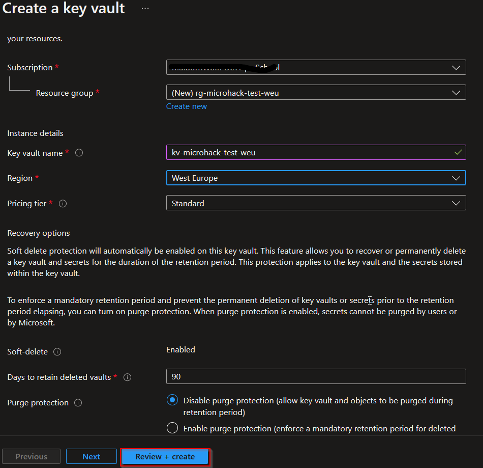
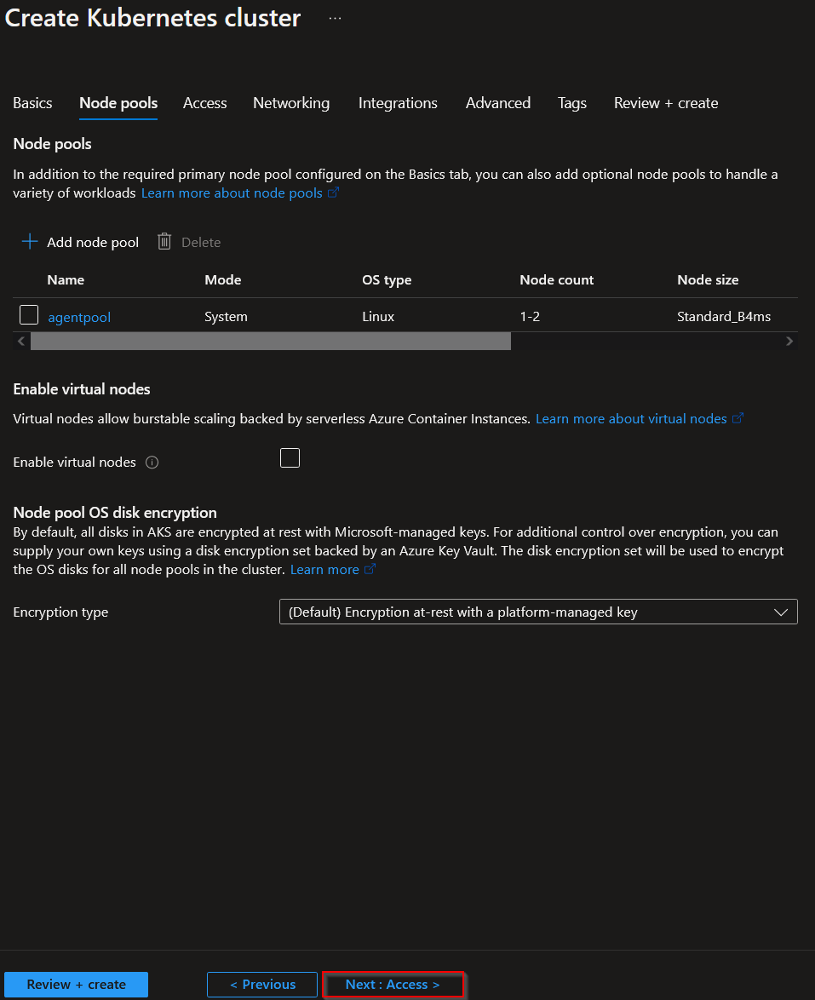
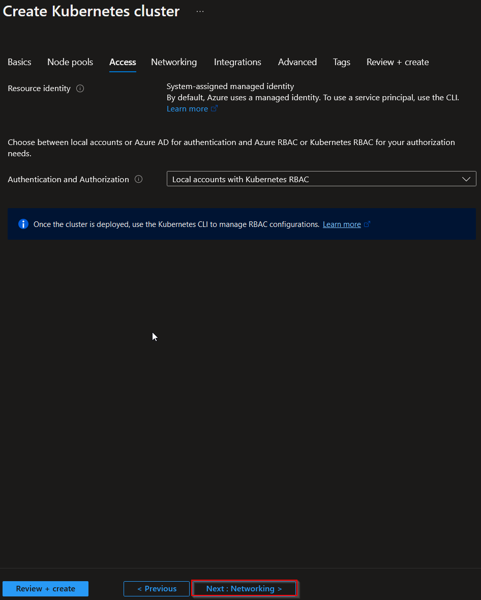

# Challenge 1: Set up the environment

**[Home](../README.md)** - [Next Challenge Solution](./02-Deploy-and-configure-solution.md)

Feel free to create your environment using any source you prefer. The following links provide solutions for utilizing the Portal, the CLI, or Terraform

- [Portal](https://learn.microsoft.com/en-us/azure/aks/learn/quick-kubernetes-deploy-portal?tabs=azure-cli)
- [CLI](https://learn.microsoft.com/en-us/azure/aks/learn/quick-kubernetes-deploy-cli)
- [Terraform](https://learn.hashicorp.com/tutorials/terraform/aks)

Here, you can learn how to set up everything using the Azure Portal.

## Step 1: Naming convention

In Azure, it is recommended to use a naming convention, as certain resources require globally unique names.
For our microhack, we will go with the best practice convention provided by microsoft, which has the following structure:

A detailed overview of all the shortcuts can be found here [link](https://learn.microsoft.com/en-us/azure/cloud-adoption-framework/ready/azure-best-practices/resource-naming)

## Step 2: Setting up the keyvault

The first resource we are going to deploy is a KeyVault. It We will start by deploying a KeyVault, which will serve as a secure storage for our secrets.
Go to the menu 'Create new resource' in the Portal and complete the forms as shown:

## Step 3: Setting up the AKS

Now we create the AKS via the portal. Once again, access the resource creation menu, go to Kubernetes Services, and complete all the required fields as depicted in the picture. We will utilize the same resource group as as the one used for the KeyVault:
Standard Setup:

Nodepools:

Access:

Network:

## Step 4: Accessing the resources

Azure offers various methods to access resources, such as through the Portal or CLI. Therefore, it is crucial to implement a well-defined permission concept. You can find some best practices related to permissions at the following link:
[Security Design Considerations](https://learn.microsoft.com/en-us/azure/cloud-adoption-framework/ready/landing-zone/design-area/security)
