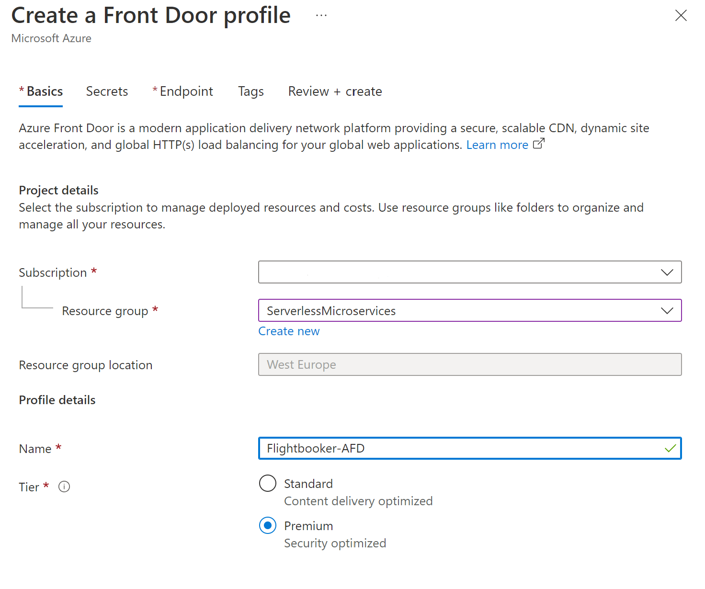
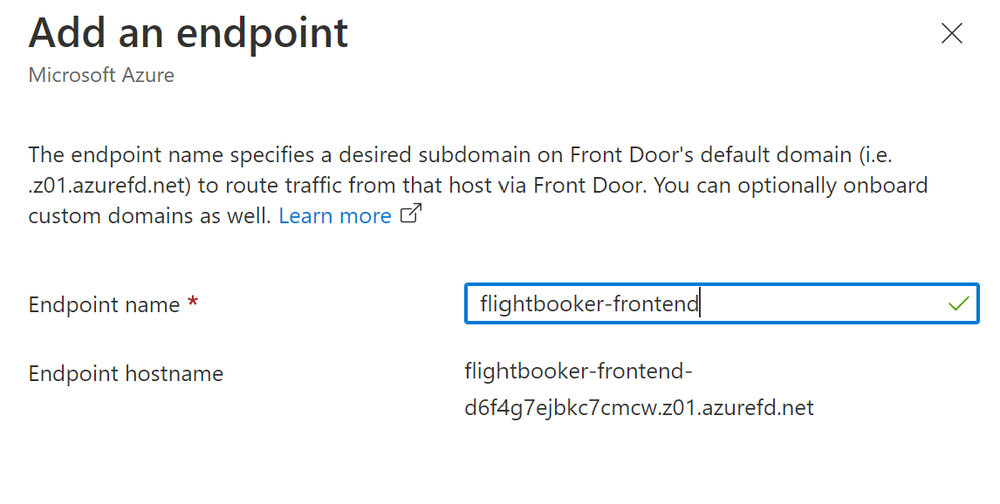
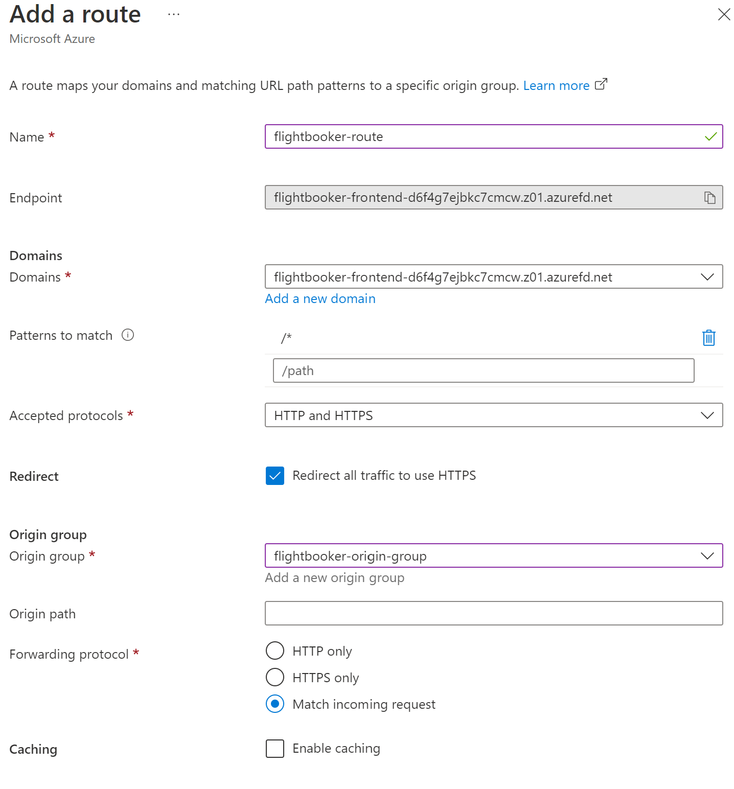
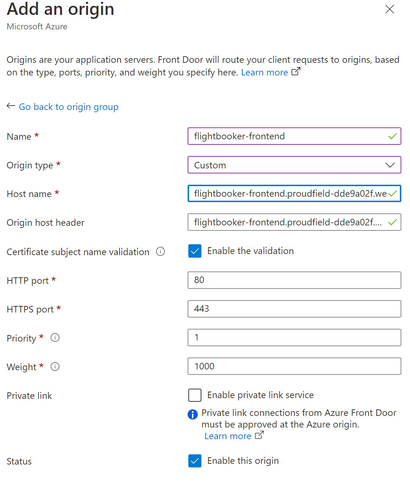

# Challenge 4: Integrate Azure Front Door
[Previous Challenge Solution](03-GitHub-Actions-solution.md) - **[Home](../README.md)**

## Task 1: Add Azure FrontDoor to your platform

A quickstart for setting up Azure Front Door with Azure Portal, CLI, PowerShell or Bicep for your App Service you can find [here](https://learn.microsoft.com/en-us/azure/frontdoor/create-front-door-portal) under the "Create a Front Door for your application" section.

1. Search for Front Door and CDN profiles and select Create. Since we already have an application you can select Custom create and continue.

2. On the Basics tab enter the following information (or adjust them to your settings) and then select <b>Next:Secrets</b>. In the subscription field choose the subscription you also used to create the Microservices. Same goes for the resource group.

3. We can skip the secrets step for now but optionally if you have and existing Key Vault in azure that you plan to use to bring your own certificate for a custom domain, then add a certificate but you can also add one in the management experience after creation of the FrontDoor.

4. Go to <b>Next:Endpoint</b> and add an endpoint. You can give it a name you seem fit, it'll automatically create an endpoint hostname for you, then click "add".

5. Then select <b>Add a route</b> to configure routing to your Web App origin. On the Add a route page, enter the following information:

You will also want to create a new origin group like this:

The origin host name is the FQDN of the your frontend without https://.

6.

## Task 2: Monitor your application

### Access Reports

Azure Front Door analytics reports provide a built-in and all-around view of how your Azure Front Door behaves along with associated Web Application Firewall metrics. You can also take advantage of Access Logs to do further troubleshooting and debugging.

Go to your Azure Front Door and in the navigation pane select Reports or Security under Analytics. You can choose between seven diferent dimensions:
* Traffic by domain
* Usage
* Traffic by location
* Cache
* Top url
* Top referrer
* Top user agent
After choosing the dimension, you can select different filters for a select time range, location, protocol or domains. 
To learn more about what the different dimensions tell you, look [here](https://learn.microsoft.com/en-us/azure/frontdoor/standard-premium/how-to-reports).

### Metrics
Azure Front Door is integrated with Azure Monitor and has 11 metrics to help monitor Azure Front Door in real-time to track, troubleshoot, and debug issues.

From the Azure portal menu select All Resource and then your Front Door profile.  
Under Monitoring select Metrics and choose a metric to add. You can add filters and apply splitting to split data by different dimensions.

[More on metrics](https://learn.microsoft.com/en-us/azure/frontdoor/standard-premium/how-to-monitor-metrics)

### Protocols

Select your Azure Front Door profile. In the profile, go to Monitoring, select Diagnostic Setting and select Add diagnostic setting.  
Enter a name for your Diagnostic setting, then select the log from FrontDoorAccessLog, FrontDoorHealthProbeLog and FrontDoorWebApplicationFirewallLog.  
You can select destination details to "Send to Log Analytics" and save.  

For more information about the different logs, go [here](https://learn.microsoft.com/en-us/azure/frontdoor/standard-premium/how-to-logs).
